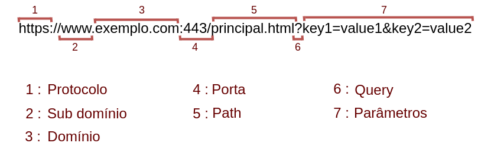

# Barra de endereços 
	A barra de endereço especifica o local na internet onde o arquivo/página web está localizado e essa é constituída de vários elementos como veremos a seguir na imagem. 

	
## Protocolo 
	https:// e http:// Aparecem na parte inicial do endereço 